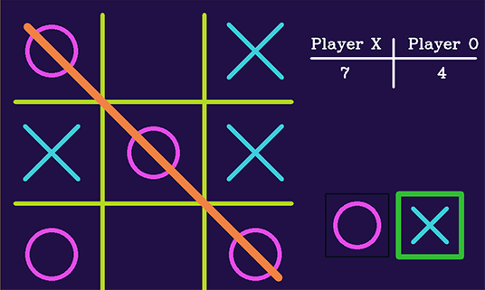

# **Tic Tac Toe**

***The Tic-Tac-Toe game is also known as the “Noughts and crosses”. It is one of most widespread pen-and-paper based game for two players.***

It is mostly placed by young children, but many a time, you can also spot adults playing this to cut-off boredom. This game is quite handy and is played anywhere, with just two players. Each player has to choose one symbol between X and O. The game is played in the 3×3 grid. Each player can place only one symbol per turn and then the turn gets relayed to the other player.

## **Game paradigm**:

- **Winning:** Each of the players tries to place their symbols in three adjacent horizontal, vertical, or diagonal cells. One who achieves this alignment earlier is the winner. While the second Player tries to interrupt Player 1’s alignment by placing his own symbols in between the symbols of Player 1.
- **Loosing:** If your competitor gets the required alignment of symbols first, you lose.
- **Draw:** If all the nine cells of the grip are marked, and none of the players, achieves the required alignment. The condition is a draw or tie. None of the players gets a point in this case. This condition takes place numerous times during the game-play and is actually amusing.

## **About it**
Due to its simplicity, tic-tac-toe is considered to be a perfect pedagogical tool for teaching logic-building and sportsmanship to children. Technically, there is much more to it, you can create a game tree using artificial intelligence that shows you the possibility of all combinations of the symbols and cells. If the game is played optimally by both the players, the game will end in a draw. This makes tic-tac-toe a futile game.

Here, is a game of tic tac toe for 2 players implemented using OpenCV. I have seen a lot of tic tac toe coded for the terminal and I personally never enjoyed playing as instead of just a simple mouse click you have to enter  the row and column number.

- The computer randomly assigns one of the symbols to player1 and other to player2.
- The players may start playing by just clicking on the cell they wish to put their symbol on.
- The game calculates scores for both the players and displays as a table on the side.

- If any player wins, you'll see an animated line connecting the 3 same symbols.
- The green coloured highlighted box on the right tells which player has the move and it switches based on the turn.
- If the game is a draw, then you don't have to worry about running the program again. The computer would clean up the board for you and you're ready for another play :)
- If you're done playing, press 'q' on your keyboard to quit.

